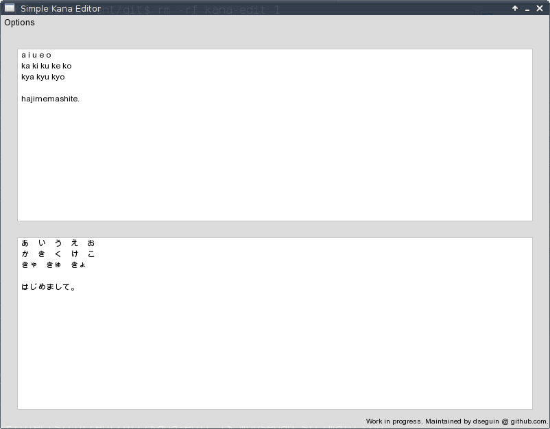
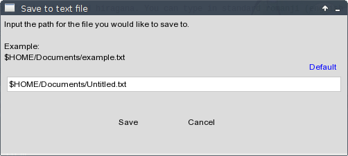

# Simple kana editor
kana-edit is a simple editor for <a href="https://en.wikipedia.org/wiki/Katakana">katakana</a> and <a href="https://en.wikipedia.org/wiki/Hiragana">hiragana</a>. You can type in standard <a href="https://en.wikipedia.org/wiki/R%C5%8Dmaji">romaji</a> (english representations of kana characters) and it will "translate" what you type *on the fly*.



The top box is the input field--where input text is displayed, and the lower box is the output field--where the processed kana is displayed. In the top left is an options menu, where you can...

- Switch between Katakana mode and Hiragana mode
- Clear the screen (both text fields)
- Save what is in the output field to a unicode text file
- Exit the program



The program uses <a href="http://www.sfml-dev.org/">SFML</a> as a display interface. Future updates may make use of SFML's other features, such as sound or networking. Currently, only linux is supported, but a Windows build is in the works.

# Compiling on Windows
Building kana-edit requires:
- sfml libraries (>=2.0)
- Visual Studio (or at least the visual c/c++ compiler)
   - MinGW/g++ may work, remains untested.
- git utility (optional)

Use your git utility to clone this repository
```
> git clone https://github.com/dseguin/kana-edit.git
```
or simply download and extract the <a href="https://github.com/dseguin/kana-edit/archive/master.zip">latest version of the repo</a>. Make sure you also have the appropriate <a href="http://www.sfml-dev.org/download.php">SFML libraries</a>.

Open a command prompt through your IDE to have the appropriate variables set. Change your directory to where you extracted or cloned the kana-edit repo:
```
> cd path/to/kana-edit
```
Now compile with:
```
> cl /EHsc src/*.cpp /Fekanaedit.exe /I<path/to/SFML/include> /link <path/to/SFML/lib>/sfml-graphics.lib <path/to/SFML/lib>/sfml-window.lib <path/to/SFML/lib>/sfml-system.lib
```
Then copy the appropriate .dlls from `<path/to/SFML/bin>` (system, graphics, window) to the folder containing the newly created kanaedit.exe. The .dlls need to be in the same directory for the program to run.

# Compiling on Linux
What follows are instructions for building kana-edit on Linux.

### Dependencies
Here's a list of what you'll need to build kana-edit:
- sfml-dev >=2.0
- g++
- GNU autotools (autoconf, automake, Make)

Some linux machines don't come with unicode support, so make sure your system can display characters within the <a href="https://en.wikipedia.org/wiki/Hiragana_%28Unicode_block%29">hiragana</a> and <a href="https://en.wikipedia.org/wiki/Katakana_%28Unicode_block%29">katakana</a> blocks.

### Build kana-edit
To build kana-edit, make sure you have a fresh clone.
```
$ git clone https://github.com/dseguin/kana-edit.git
$ cd kana-edit
```
For compatability reasons, you should run autoreconf to match your version of aclocal.
```
$ autoreconf --install
```
Then change to the build directory.
```
$ cd build
```
There are two scripts to run. The first attempts to change define macros in include/defines.h to suit the machine that builds it. The second is a configure script generated by GNU autotools.
```
$ ../autodefine.sh
$ ../configure
```
And now to make and run the program.
```
$ make
$ src/kanaedit
```

# Troubleshooting (Linux)
The most common problem relates to the define paths in <a href="include/defines.h">include/defines.h</a>. The autodefine.sh will handle this in most cases, but it may be necessary to adjust these yourself.
- `FONT_ARIAL` : This defines the path to resources/arial.ttf
- `FONT_MANGAL` : This defines the path to resources/mangal.ttf
- `DEFAULT_SAVE_PATH` : This defines the folder where documents are saved by default
- `MKDIR_PATH` : This defines the path to the mkdir executable (run 'whereis mkdir' to find it)

These should be absolute paths to guarantee that the program will run from any working directory.

### Linking issues
Another common issue is with linking SFML libraries, especially if you've built the libraries manually:
#### Undefined reference to ...
This means your linker doesn't know the location of the SFML libraries. If you yourself do not know where these libraries are, you can try this command:
```
$ find / libsfml* 2>/dev/null | grep libsfml
```
The easiest way to fix this is to add the location to your linker's path variable. If your linker doesn't allow that, or you would rather try something else, you can change this line in <a href="src/Makefile.am">src/Makefile.am</a>
```
kanaedit_LDADD = -lsfml-window -lsfml-system -lsfml-graphics
```
to this
```
kanaedit_LDADD = -L/path/to/sfml/libraries -lsfml-window -lsfml-system -lsfml-graphics
```
and then rerun autoreconf from the top directory.
```
$ cd /path/to/kana-edit
$ autoreconf --install
```
#### Error while loading shared libraries ... No such file or directory
This means that you've successfully compiled the program, but the program can't find your SFML libraries.

There are at least two ways to fix this. The first is to simply copy the libraries (or symlink them) to the directory containing the kanaedit binary. The second way is to add your lib path to a shell variable:
```
$ LD_LIBRARY_PATH=/path/to/sfml/libraries
$ echo $LD_LIBRARY_PATH
$ export LD_LIBRARY_PATH
```
Then try runing the program again.

# Contact
You can always contact me through Github or by email if you have any questions. If you found a bug, let me know--or better yet, post an issue on the Github project page. If you see a part that could be done better, or you want to contribute, you're very welcome to do so.
